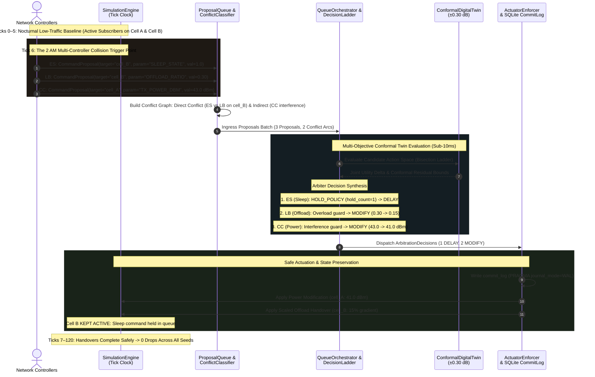

# The 2 AM Collision Arbitration Sequence

```mermaid
sequenceDiagram
    autonumber
    actor Operators as Network Controllers
    participant Sim as SimulationEngine<br/>(Tick Clock)
    participant Queue as ProposalQueue &<br/>ConflictClassifier
    participant Orch as QueueOrchestrator &<br/>DecisionLadder
    participant Twin as ConformalDigitalTwin<br/>(±0.30 dB)
    participant Act as ActuatorEnforcer<br/>& SQLite CommitLog

    Note over Sim,Operators: Ticks 0–5: Nocturnal Low-Traffic Baseline (Active Subscribers on Cell A & Cell B)

    rect rgb(30, 25, 20)
        Note over Sim,Operators: Tick 6: The 2 AM Multi-Controller Collision Trigger Point
        Operators->>Queue: ES: CommandProposal(target="cell_B", param="SLEEP_STATE", val=1.0)
        Operators->>Queue: LB: CommandProposal(target="cell_B", param="OFFLOAD_RATIO", val=0.30)
        Operators->>Queue: CC: CommandProposal(target="cell_A", param="TX_POWER_DBM", val=43.0 dBm)
    end

    Queue->>Queue: Build Conflict Graph: Direct Conflict (ES vs LB on cell_B) & Indirect (CC interference)
    Queue->>Orch: Ingress Proposals Batch (3 Proposals, 2 Conflict Arcs)

    rect rgb(20, 30, 35)
        Note over Orch,Twin: Multi-Objective Conformal Twin Evaluation (Sub-10ms)
        Orch->>Twin: Evaluate Candidate Action Space (Bisection Ladder)
        Twin-->>Orch: Joint Utility Delta & Conformal Residual Bounds
        
        Note over Orch: Arbiter Decision Synthesis
        Note over Orch: 1. ES (Sleep): HOLD_POLICY (hold_count=1) -> DELAY
        Note over Orch: 2. LB (Offload): Overload guard -> MODIFY (0.30 -> 0.15)
        Note over Orch: 3. CC (Power): Interference guard -> MODIFY (43.0 -> 41.0 dBm)
    end

    Orch->>Act: Dispatch ArbitrationDecisions (1 DELAY, 2 MODIFY)
    
    rect rgb(25, 35, 25)
        Note over Act,Sim: Safe Actuation & State Preservation
        Act->>Act: Write commit_log (PRAGMA journal_mode=WAL)
        Act->>Sim: Apply Power Modification (cell_A: 41.0 dBm)
        Act->>Sim: Apply Scaled Offload Handover (cell_B: 15% gradient)
        Note over Sim: Cell B KEPT ACTIVE: Sleep command held in queue
    end

    Note over Sim: Ticks 7–120: Handovers Complete Safely -> 0 Drops Across All Seeds
```
