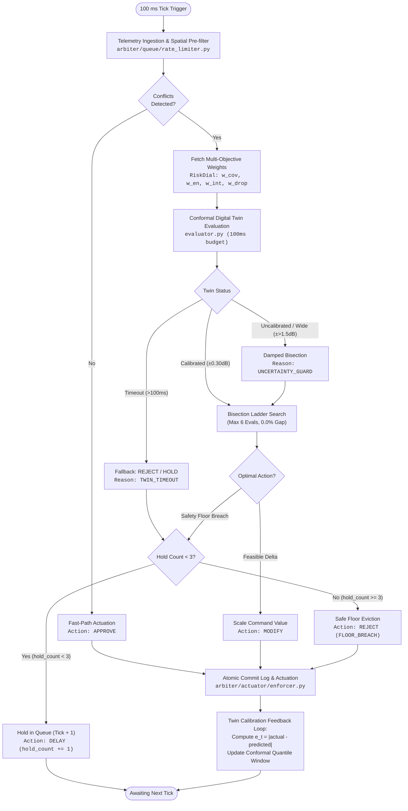

# The 100 ms Control Loop & Feedback Paths

```mermaid
flowchart TD
    START(["100 ms Tick Trigger"]) --> INGEST["Telemetry Ingestion & Spatial Pre-filter<br/><code>arbiter/queue/rate_limiter.py</code>"]
    INGEST --> CONFLICT_CHECK{"Conflicts<br/>Detected?"}

    CONFLICT_CHECK -- No --> APPROVE_FAST["Fast-Path Actuation<br/><code>Action: APPROVE</code>"]
    APPROVE_FAST --> COMMIT["Atomic Commit Log & Actuation<br/><code>arbiter/actuator/enforcer.py</code>"]

    CONFLICT_CHECK -- Yes --> RISK_DIAL["Fetch Multi-Objective Weights<br/><code>RiskDial: w_cov, w_en, w_int, w_drop</code>"]
    RISK_DIAL --> TWIN_EVAL["Conformal Digital Twin Evaluation<br/><code>evaluator.py (100ms budget)</code>"]

    TWIN_EVAL --> TWIN_STATUS{"Twin Status"}
    TWIN_STATUS -- "Timeout (>100ms)" --> TIMEOUT_REASON["Fallback: REJECT / HOLD<br/><code>Reason: TWIN_TIMEOUT</code>"]
    TWIN_STATUS -- "Uncalibrated / Wide (±>1.5dB)" --> UNCERTAIN_REASON["Damped Bisection<br/><code>Reason: UNCERTAINTY_GUARD</code>"]
    TWIN_STATUS -- "Calibrated (±0.30dB)" --> LADDER_OPTIMIZE["Bisection Ladder Search<br/>(Max 6 Evals, 0.0% Gap)"]

    TIMEOUT_REASON --> HOLD_CHECK
    UNCERTAIN_REASON --> LADDER_OPTIMIZE

    LADDER_OPTIMIZE --> ACTION_SELECT{"Optimal Action?"}
    ACTION_SELECT -- "Feasible Delta" --> MODIFY_PATH["Scale Command Value<br/><code>Action: MODIFY</code>"]
    ACTION_SELECT -- "Safety Floor Breach" --> HOLD_CHECK{"Hold Count < 3?"}

    HOLD_CHECK -- Yes (hold_count < 3) --> DELAY_PATH["Hold in Queue (Tick + 1)<br/><code>Action: DELAY (hold_count += 1)</code>"]
    HOLD_CHECK -- No (hold_count >= 3) --> REJECT_PATH["Safe Floor Eviction<br/><code>Action: REJECT (FLOOR_BREACH)</code>"]

    DELAY_PATH --> NEXT_TICK(["Awaiting Next Tick"])
    MODIFY_PATH --> COMMIT
    REJECT_PATH --> COMMIT

    COMMIT --> RESIDUAL_UPDATE["Twin Calibration Feedback Loop:<br/>Compute e_t = |actual - predicted|<br/>Update Conformal Quantile Window"]
    RESIDUAL_UPDATE --> NEXT_TICK
```
