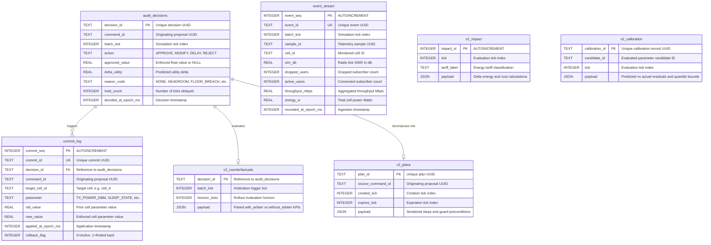

# Data Model & Schema Relationships

```mermaid
erDiagram
    commit_log {
        INTEGER commit_seq PK "AUTOINCREMENT"
        TEXT commit_id UK "Unique commit UUID"
        TEXT decision_id FK "Reference to audit_decisions"
        TEXT command_id "Originating proposal UUID"
        TEXT target_cell_id "Target cell, e.g. cell_A"
        TEXT parameter "TX_POWER_DBM, SLEEP_STATE, etc."
        REAL old_value "Prior cell parameter value"
        REAL new_value "Enforced cell parameter value"
        INTEGER applied_at_epoch_ms "Application timestamp"
        INTEGER rollback_flag "0=Active, 1=Rolled back"
    }

    audit_decisions {
        TEXT decision_id PK "Unique decision UUID"
        TEXT command_id "Originating proposal UUID"
        INTEGER batch_tick "Simulation tick index"
        TEXT action "APPROVE, MODIFY, DELAY, REJECT"
        REAL approved_value "Enforced float value or NULL"
        REAL delta_utility "Predicted utility delta"
        TEXT reason_code "NONE, HEADROOM, FLOOR_BREACH, etc."
        INTEGER hold_count "Number of ticks delayed"
        INTEGER decided_at_epoch_ms "Decision timestamp"
    }

    event_stream {
        INTEGER event_seq PK "AUTOINCREMENT"
        TEXT event_id UK "Unique event UUID"
        INTEGER batch_tick "Simulation tick index"
        TEXT sample_id "Telemetry sample UUID"
        TEXT cell_id "Monitored cell ID"
        REAL sinr_db "Radio link SINR in dB"
        INTEGER dropped_users "Dropped subscriber count"
        INTEGER active_users "Connected subscriber count"
        REAL throughput_mbps "Aggregated throughput Mbps"
        REAL energy_w "Total cell power Watts"
        INTEGER recorded_at_epoch_ms "Ingestion timestamp"
    }

    v2_plans {
        TEXT plan_id PK "Unique plan UUID"
        TEXT source_command_id "Originating proposal UUID"
        INTEGER created_tick "Creation tick index"
        INTEGER expires_tick "Expiration tick index"
        JSON payload "Serialized steps and guard preconditions"
    }

    v2_counterfactuals {
        TEXT decision_id PK "Reference to audit_decisions"
        INTEGER batch_tick "Arbitration trigger tick"
        INTEGER horizon_ticks "Rollout evaluation horizon"
        JSON payload "Paired with_arbiter vs without_arbiter KPIs"
    }

    v2_impact {
        INTEGER impact_id PK "AUTOINCREMENT"
        INTEGER tick "Evaluation tick index"
        TEXT tariff_label "Energy tariff classification"
        JSON payload "Delta energy and cost calculations"
    }

    v2_calibration {
        TEXT calibration_id PK "Unique calibration record UUID"
        TEXT candidate_id "Evaluated parameter candidate ID"
        INTEGER tick "Evaluation tick index"
        JSON payload "Predicted vs actual residuals and quantile bounds"
    }

    audit_decisions ||--o{ commit_log : "triggers"
    audit_decisions ||--o| v2_counterfactuals : "evaluates"
    audit_decisions ||--o| v2_plans : "decomposes into"
```
