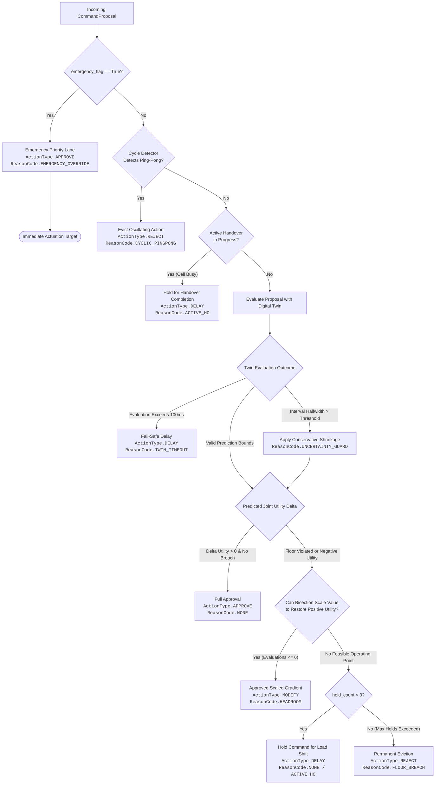

# Decision Ladder & Reason Codes

```mermaid
flowchart TD
    CMD["Incoming CommandProposal"] --> IS_EMERGENCY{"emergency_flag == True?"}
    
    %% Emergency Bypass Lane
    IS_EMERGENCY -- Yes --> BYPASS["Emergency Priority Lane<br/><code>ActionType.APPROVE</code><br/><code>ReasonCode.EMERGENCY_OVERRIDE</code>"]
    BYPASS --> ACTUATE(["Immediate Actuation Target"])

    %% Normal Evaluation
    IS_EMERGENCY -- No --> CHECK_PINGPONG{"Cycle Detector<br/>Detects Ping-Pong?"}
    CHECK_PINGPONG -- Yes --> REJECT_PINGPONG["Evict Oscillating Action<br/><code>ActionType.REJECT</code><br/><code>ReasonCode.CYCLIC_PINGPONG</code>"]

    CHECK_PINGPONG -- No --> CHECK_HO{"Active Handover<br/>in Progress?"}
    CHECK_HO -- Yes (Cell Busy) --> HOLD_HO["Hold for Handover Completion<br/><code>ActionType.DELAY</code><br/><code>ReasonCode.ACTIVE_HO</code>"]

    CHECK_HO -- No --> EVAL_TWIN["Evaluate Proposal with Digital Twin"]
    
    %% Twin Error Guardrails
    EVAL_TWIN --> TWIN_OUT{"Twin Evaluation Outcome"}
    TWIN_OUT -- "Evaluation Exceeds 100ms" --> DELAY_TIMEOUT["Fail-Safe Delay<br/><code>ActionType.DELAY</code><br/><code>ReasonCode.TWIN_TIMEOUT</code>"]
    TWIN_OUT -- "Interval Halfwidth > Threshold" --> DAMP_UNCERTAIN["Apply Conservative Shrinkage<br/><code>ReasonCode.UNCERTAINTY_GUARD</code>"]
    
    TWIN_OUT -- "Valid Prediction Bounds" --> UTILITY_CHECK{"Predicted Joint Utility Delta"}
    DAMP_UNCERTAIN --> UTILITY_CHECK

    %% Utility & Safety Floors
    UTILITY_CHECK -- "Delta Utility > 0 & No Breach" --> APPROVE_NORMAL["Full Approval<br/><code>ActionType.APPROVE</code><br/><code>ReasonCode.NONE</code>"]
    
    UTILITY_CHECK -- "Floor Violated or Negative Utility" --> BISECTION{"Can Bisection Scale Value<br/>to Restore Positive Utility?"}
    
    BISECTION -- "Yes (Evaluations <= 6)" --> MODIFY_HEADROOM["Approved Scaled Gradient<br/><code>ActionType.MODIFY</code><br/><code>ReasonCode.HEADROOM</code>"]
    
    BISECTION -- "No Feasible Operating Point" --> HOLD_LIMIT{"hold_count < 3?"}
    HOLD_LIMIT -- Yes --> DELAY_FLOOR["Hold Command for Load Shift<br/><code>ActionType.DELAY</code><br/><code>ReasonCode.NONE / ACTIVE_HO</code>"]
    HOLD_LIMIT -- No (Max Holds Exceeded) --> REJECT_FLOOR["Permanent Eviction<br/><code>ActionType.REJECT</code><br/><code>ReasonCode.FLOOR_BREACH</code>"]
```
