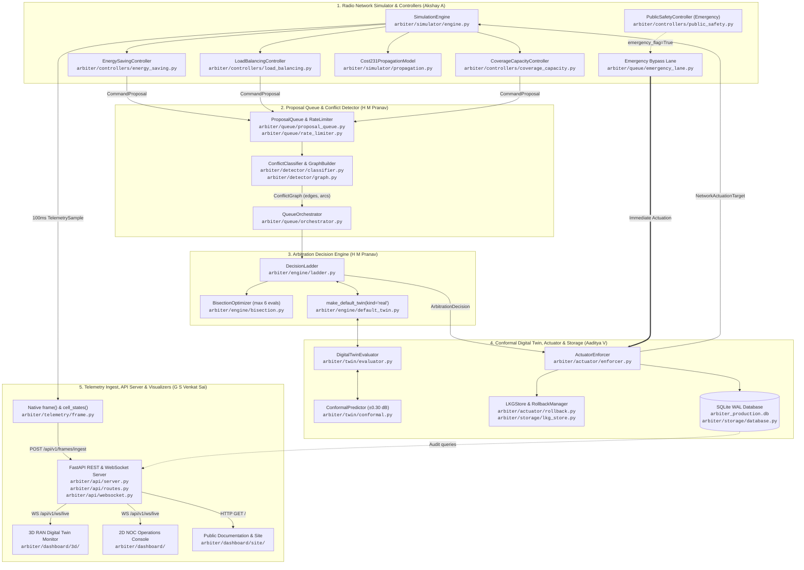

# System Architecture

```mermaid
flowchart TB
    subgraph S1["1. Radio Network Simulator & Controllers (Akshay A)"]
        SIM["SimulationEngine<br/><code>arbiter/simulator/engine.py</code>"]
        CTRL_ES["EnergySavingController<br/><code>arbiter/controllers/energy_saving.py</code>"]
        CTRL_LB["LoadBalancingController<br/><code>arbiter/controllers/load_balancing.py</code>"]
        CTRL_CC["CoverageCapacityController<br/><code>arbiter/controllers/coverage_capacity.py</code>"]
        CTRL_PS["PublicSafetyController (Emergency)<br/><code>arbiter/controllers/public_safety.py</code>"]
        PROP_MODEL["Cost231PropagationModel<br/><code>arbiter/simulator/propagation.py</code>"]
        
        SIM --> PROP_MODEL
        SIM --> CTRL_ES & CTRL_LB & CTRL_CC
        CTRL_PS -.->|"emergency_flag=True"| BYPASS["Emergency Bypass Lane<br/><code>arbiter/queue/emergency_lane.py</code>"]
    end

    subgraph S2["2. Proposal Queue & Conflict Detector (H M Pranav)"]
        QUEUE["ProposalQueue & RateLimiter<br/><code>arbiter/queue/proposal_queue.py</code><br/><code>arbiter/queue/rate_limiter.py</code>"]
        DETECTOR["ConflictClassifier & GraphBuilder<br/><code>arbiter/detector/classifier.py</code><br/><code>arbiter/detector/graph.py</code>"]
        ORCH["QueueOrchestrator<br/><code>arbiter/queue/orchestrator.py</code>"]

        CTRL_ES & CTRL_LB & CTRL_CC -->|"CommandProposal"| QUEUE
        QUEUE --> DETECTOR
        DETECTOR -->|"ConflictGraph (edges, arcs)"| ORCH
    end

    subgraph S3["3. Arbitration Decision Engine (H M Pranav)"]
        LADDER["DecisionLadder<br/><code>arbiter/engine/ladder.py</code>"]
        BISECT["BisectionOptimizer (max 6 evals)<br/><code>arbiter/engine/bisection.py</code>"]
        FACTORY["make_default_twin(kind='real')<br/><code>arbiter/engine/default_twin.py</code>"]
        
        ORCH --> LADDER
        LADDER --> BISECT
        LADDER <--> FACTORY
    end

    subgraph S4["4. Conformal Digital Twin, Actuator & Storage (Aaditya V)"]
        TWIN["DigitalTwinEvaluator<br/><code>arbiter/twin/evaluator.py</code>"]
        CONF["ConformalPredictor (±0.30 dB)<br/><code>arbiter/twin/conformal.py</code>"]
        ACTUATOR["ActuatorEnforcer<br/><code>arbiter/actuator/enforcer.py</code>"]
        LKG["LKGStore & RollbackManager<br/><code>arbiter/actuator/rollback.py</code><br/><code>arbiter/storage/lkg_store.py</code>"]
        DB[("SQLite WAL Database<br/><code>arbiter_production.db</code><br/><code>arbiter/storage/database.py</code>")]

        FACTORY <--> TWIN
        TWIN <--> CONF
        LADDER -->|"ArbitrationDecision"| ACTUATOR
        ACTUATOR --> LKG
        ACTUATOR --> DB
        ACTUATOR -->|"NetworkActuationTarget"| SIM
        BYPASS ==>|"Immediate Actuation"| ACTUATOR
    end

    subgraph S5["5. Telemetry Ingest, API Server & Visualizers (G S Venkat Sai)"]
        FRAME["Native frame() & cell_states()<br/><code>arbiter/telemetry/frame.py</code>"]
        API["FastAPI REST & WebSocket Server<br/><code>arbiter/api/server.py</code><br/><code>arbiter/api/routes.py</code><br/><code>arbiter/api/websocket.py</code>"]
        UI_3D["3D RAN Digital Twin Monitor<br/><code>arbiter/dashboard/3d/</code>"]
        UI_2D["2D NOC Operations Console<br/><code>arbiter/dashboard/</code>"]
        UI_SITE["Public Documentation & Site<br/><code>arbiter/dashboard/site/</code>"]

        SIM -->|"100ms TelemetrySample"| FRAME
        FRAME -->|"POST /api/v1/frames/ingest"| API
        API -->|"WS /api/v1/ws/live"| UI_3D
        API -->|"WS /api/v1/ws/live"| UI_2D
        API -->|"HTTP GET /"| UI_SITE
        DB -.->|"Audit queries"| API
    end
```
